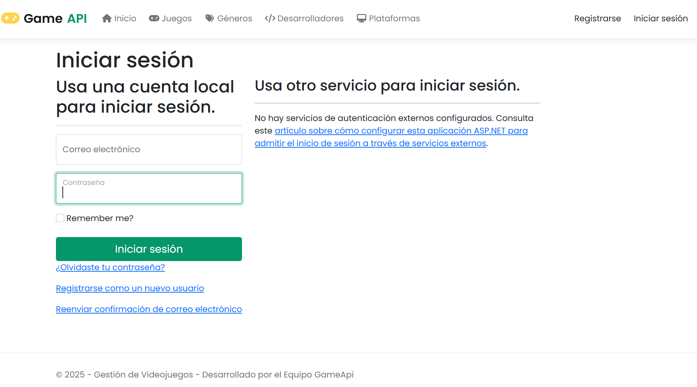
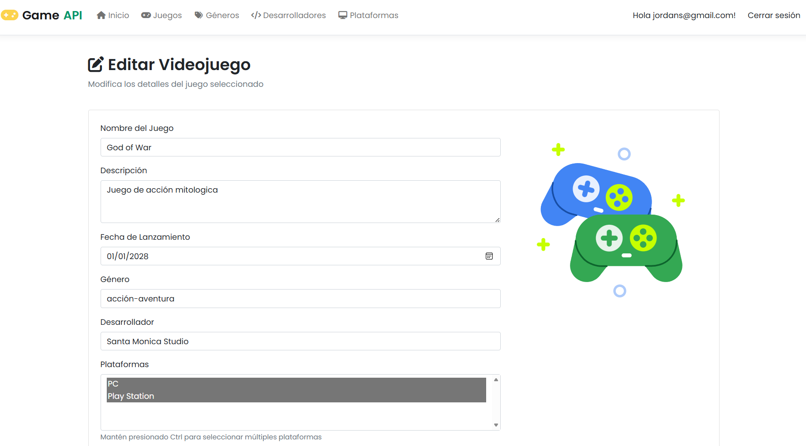
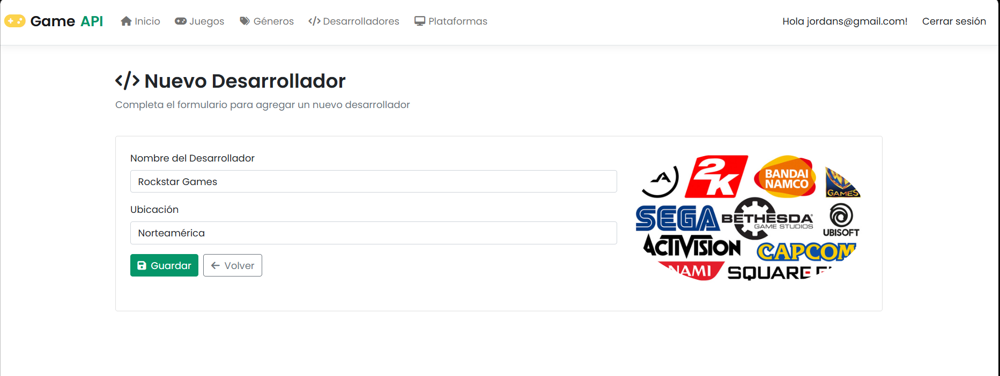

# GameAPIRest

Sistema Web y API RESTful desarrollada con **.NET / C# (ASP.NET Core)** para la gestión, clasificación y administración de videojuegos, desarrolladores, géneros y plataformas, integrando autenticación y autorización mediante ASP.NET Core Identity.

## 🤝 Colaboradores

- [@Diret03](https://github.com/Diret03/)
- [@Jordi021](https://github.com/Jordi021)

---

## 🖼️ Capturas de Pantalla

A continuación se muestra la interfaz del sistema:

### Autenticación de Usuarios (Login / Registro)


### Gestión de Juegos (Módulo CRUD)


### Gestión de Desarrolladores


---

## 🛠️ Estructura del Proyecto

- `GameAPI.Rest`: API RESTful backend construida con ASP.NET Core.
- `GameAPI.WebMVC`: Aplicación cliente Web MVC que consume la API REST y gestiona la interfaz de usuario con ASP.NET Core Identity.
- `GameAPI.Models`: Librería de clases compartida con los modelos de datos y DTOs.
- `GameAPI.ConsumeAPI`: Capa de servicios para el consumo de endpoints REST.
- `GameAPI.Test`: Proyecto de pruebas unitarias.

---

## 🚀 Instalación y Configuración

### Requisitos Previos
- [.NET 8.0 SDK](https://dotnet.microsoft.com/download) o superior.
- SQL Server / LocalDB instalado y configurado.

### 1. Clonar el repositorio
```bash
git clone https://github.com/Jordi021/GameAPIRest.git
cd GameAPIRest
```

### 2. Restaurar paquetes NuGet
```bash
dotnet restore
```

---

## 💻 Cómo Ejecutar la Aplicación

Para probar el sistema completo localmente, se deben iniciar tanto la API REST backend como la aplicación cliente Web MVC:

### Paso 1: Iniciar la API REST (Backend)
1. Abre una terminal y navega al directorio del backend:
   ```bash
   cd GameAPI.Rest
   ```
2. Ejecuta el backend:
   ```bash
   dotnet run
   ```
   *(La API iniciará en la dirección local correspondiente, por ejemplo `https://localhost:7000` o `http://localhost:5000`).*

### Paso 2: Iniciar la Aplicación Web MVC (Cliente Frontend)
1. Abre una segunda terminal y navega al directorio del cliente MVC:
   ```bash
   cd GameAPI.WebMVC
   ```
2. Ejecuta la aplicación cliente:
   ```bash
   dotnet run
   ```
3. Abre tu navegador e ingresa a la URL mostrada en la consola (ej. `https://localhost:7028` o `http://localhost:5001`).
4. Inicia sesión, regístrate como nuevo usuario y navega por los módulos de Juegos, Desarrolladores, Géneros y Plataformas.
